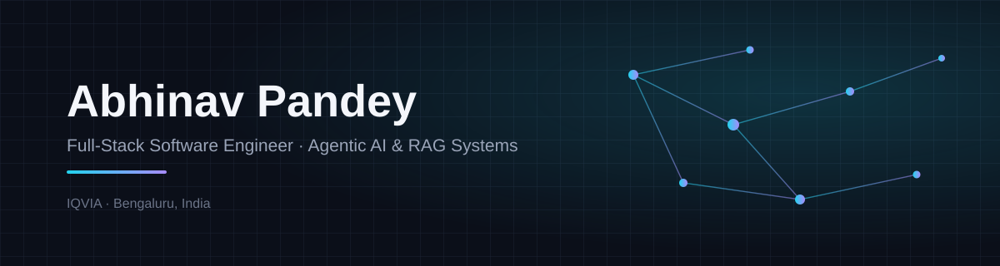
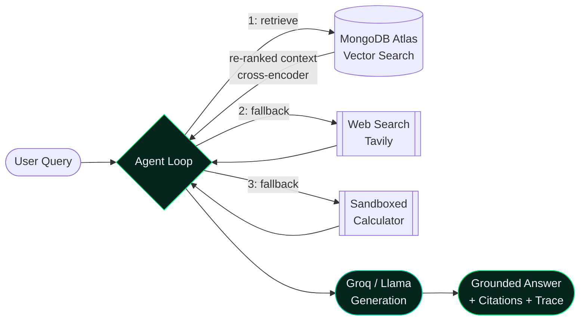
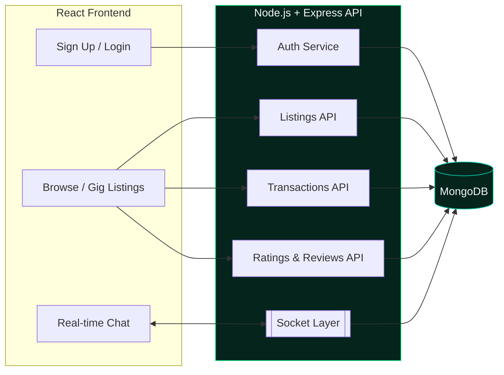
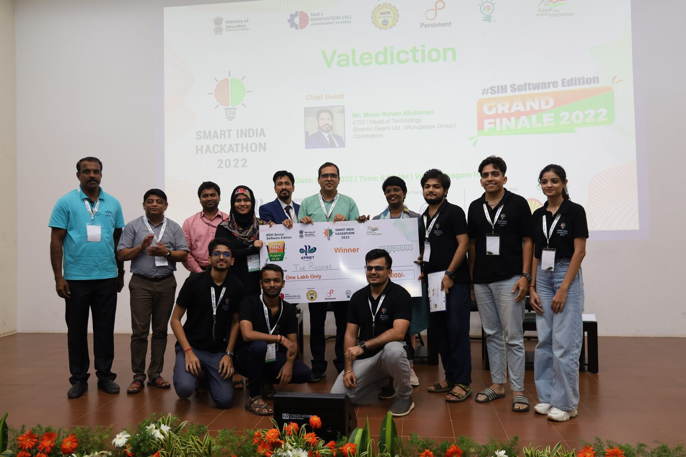

<picture>
  <source media="(prefers-color-scheme: dark)" srcset="./assets/banner-dark.svg">
  <source media="(prefers-color-scheme: light)" srcset="./assets/banner-light.svg">
  
</picture>

<br/>

<p>
<a href="https://latest-portfolio-z2oy.onrender.com"></a>
<a href="https://leetcode.com/u/abhinvnarc"></a>
<a href="https://www.linkedin.com/in/abhinav-pandey-432b62226/"></a>
<a href="mailto:pandeysandeep1190@gmail.com"></a>

</p>

## At a glance

| Manual turnaround | Page load | Table scale | Dashboard reach | Defects closed | RAG accuracy |
|:--:|:--:|:--:|:--:|:--:|:--:|
| ↓ 20% | ↓ 25–30% | 5,000+ rows/table | 50+ users · 6+ teams | 40+ resolved | 85% → 92% |

<sup>Metrics from production work at IQVIA (agentic AI for ROM/estimation) and DocMind's 13-question retrieval eval harness.</sup>

## Toolbox

```
frontend    react · redux-saga · mui data grid · react router
backend     node.js · express · .net 8 · fastapi
agentic-ai  langchain · tool-calling agents · vector re-ranking · groq/llama
data        mongodb · atlas vector search · sql server
cloud       aws (ec2 · s3 · lambda · iam · cloudwatch) · docker · firebase
quality     jwt/oidc · swagger/openapi · jest · gitlab api v4 ci/cd
```

## Experience

| | | |
|:--|:--|:--|
| **12/2024 → Present** | **Software Engineer**, IQVIA India | Agentic AI for ROM estimation & capacity forecasting (8+ projects) · pagination for 10+ tables at 5,000+ rows · KPI dashboards for 50+ users · .NET 8 microservices with JWT/OIDC |
| **12/2023 → 02/2024** | Full Stack Dev Intern, Krunk.AI | Bootstrapped a React app end-to-end; Firebase auth across 8+ modules |
| **11/2022 → 01/2023** | Chrome Ext. Dev Intern, ClickUp | "To-Doist for ClickUp" — 50+ pilot testers |
| **2024** | B.E., Mumbai University | — |

<br/>


<br/>

### 🧠 [DocMind — Agentic RAG Document Assistant](https://docmind-client-bdfn.onrender.com)
`react` `node/express` `python · fastapi` `langchain` `mongodb atlas`

A tool-calling RAG agent that grounds itself in your documents first, and only reaches for outside help when it has to.



- Cross-encoder re-ranking on retrieval lifted answer accuracy **85% → 92%** on a 13-question evaluation harness built to score retrieval + generation quality
- Full execution trace — which tool fired, why, with what result — surfaced in the UI, not buried in logs
- Diagnosed and resolved production issues (memory limits, rate limiting, Docker) across three independently deployed services on Render

### 🛒 Subs4Sale — Freelancer Marketplace
`react` `node.js` `express` `mongodb` `socket.io`

A Fiverr-style freelancer–client marketplace built solo, end to end — listings, real-time chat, transactions, and reviews on one MERN codebase.



- Designed the full MongoDB schema architecture from scratch — users, gigs, transactions, and reviews as independently queryable collections
- Built secure authentication, a real-time chat layer, and end-to-end transaction workflows (request → accept → pay → review)
- React.js frontend consuming a self-built Node.js/Express REST API; published and documented on GitHub for others to reference

<br/>


<br/>

<p align="center">

</p>

<p align="center">
<a href="https://leetcode.com/u/abhinvnarc"></a>
</p>

<br/>


<br/>

<table width="100%">
<tr>
<td width="50%" valign="top">

#### 🥇 Smart India Hackathon 2022 — Winner
**AICTE Grievance Management Portal**

A time-bound, automated resolution workflow for student grievances — recognized as the winning solution among **200+ competing teams** nationwide.

</td>
<td width="50%" valign="top">

#### 🥈 Tantrotsav Hackathon — First Runner-Up
**MERN Social Media App**

Secure authentication, real-time messaging, and Cloudinary/Zeegocloud integration, built under hackathon time pressure.

</td>
</tr>
</table>

<p align="center">

<br/>
<sub>🏆 On stage at the SIH 2022 Grand Finale, Software Edition — team win, ₹1,00,000 prize</sub>
</p>

<br/>

## Live stats

<details>
<summary><b>GitHub metrics</b> (auto-refreshes every 6h via <code>.github/workflows/metrics.yml</code>)</summary>
<br/>


<sub>Requires enabling the included <code>lowlighter/metrics</code> workflow and adding a <code>METRICS_TOKEN</code> secret (a classic PAT with <code>repo</code> + <code>read:user</code>) — see setup notes below.</sub>

</details>

<p align="center">


</p>

<p align="center">
<picture>
  <source media="(prefers-color-scheme: dark)" srcset="https://raw.githubusercontent.com/Abhinav1190P/Abhinav1190P/output/github-contribution-grid-snake-dark.svg">
  <source media="(prefers-color-scheme: light)" srcset="https://raw.githubusercontent.com/Abhinav1190P/Abhinav1190P/output/github-contribution-grid-snake.svg">
  
</picture>
<sub>Generated by <code>.github/workflows/snake.yml</code> on push to <code>output</code></sub>
</p>

---

> **Setup notes for the dynamic pieces:** this repo ships `.github/workflows/metrics.yml` and `.github/workflows/snake.yml`. Enable Actions on the repo, add a `METRICS_TOKEN` secret for the metrics workflow (Settings → Secrets → Actions), and both will start committing fresh SVGs on their schedule — the embeds above will pick them up automatically once they exist.
